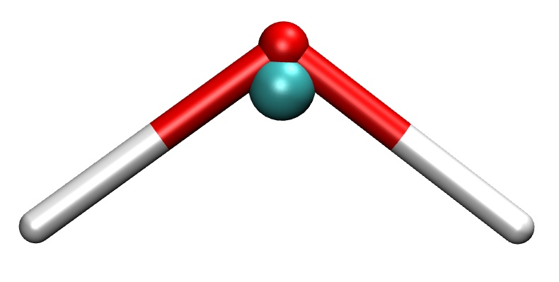
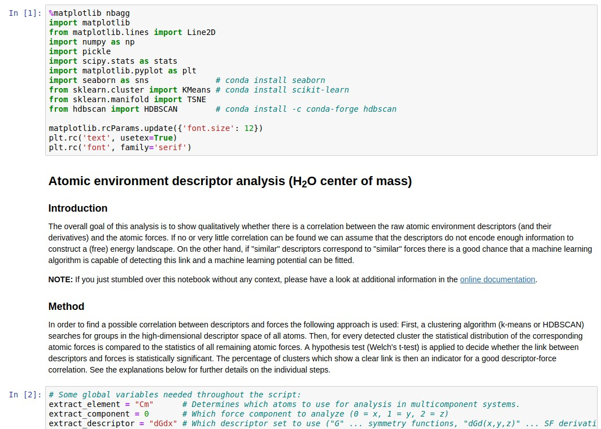

.. _cg_descriptor_analysis:

Descriptor analysis/Coarse-graining
===================================

.. warning::

   The following procedures and analyses should be considered experimental. They
   are not well-tested and there is no related peer-reviewed publication.

This short tutorial shows how to prepare and run a descriptor analysis which can
be useful when creating a coarse-grained (CG) model based on neural network
potentials. The steps outlined here correspond to the subfolders of the
``examples/coarse-graining`` directory in the repository. The descriptor
analysis itself is described in detail inside the Jupyter notebook
``step-3_cluster-analysis/analyze-descriptors.ipynb``.

.. note::

   The tools ``nnp-atomenv`` and ``nnp-scaling`` need to be compiled to follow
   the steps presented in this tutorial.

Step 0 (optional): Coarse-grained data set
""""""""""""""""""""""""""""""""""""""""""

.. note::

   This step is optional, the descriptor analysis may also yield insights if
   applied directly to the full, atomistic description of the system.

First, we need to create a data set which contains the coarse-grained
description of the original structures. In the example (directory
``step-0_cg-data-set``) we start with a data set of bulk water (``input.data``)
where we apply the following coarse-graining strategy: for each oxygen atom we
identify the two closest hydrogen neighbors and compute then the center of mass
coordinates of all molecules via

.. math::

   \vec{R} = \vec{r}_O - \frac{2 m_H \left(\Delta \vec{r}_{OH_1} + \Delta \vec{r}_{OH_2} \right)}{m_O + 2 m_H},

where :math:`\Delta \vec{r}_{jk} = \vec{r}_j - \vec{r}_k`. The force acting on
the center of mass is then just the sum of all forces in each molecule.

   A water molecule and its coarse-grained (center of mass) representation (turquoise sphere).

An example C++ code is provided to perform this conversion in ``nnp-cgdata.cpp``
making use of the ``libnnp`` library. To build the executable just run ``make``
(``libnnp`` needs to be compiled beforehand in the main ``src`` directory). Then
run the executable with an appropriate cutoff radius for the neighbor list as
the only argument:

.. code-block:: none

   ./nnp-cgdata 2.3

Here, we use a cutoff of 2.3 bohr which ensures that the two closest hydrogen
neighbors are found for each oxygen atom. This will create the file
``output.data`` which contains the desired coarse-grained center of mass
particles representing the water molecules.

.. hint::

   The "element symbol" of the CG particles in this example is ``Cm``. Normally,
   this would correspond to the element Curium but here we use it to abbreviate
   "center of mass".

The ``nnp-cgdata.cpp`` code demonstrates the usage of the C++ API to manipulate
datasets of configurations. Of course such a task can also be performed with
external software.

Step 1: Create symmetry function set
""""""""""""""""""""""""""""""""""""

This step is common to regular NNP training with *n2p2*: for a given data set we
need to prepare an appropriate symmetry function set and compute the scaling
data. Please see also :ref:`this section <symfunc_setup>` for further
information. For this example, an ``input.nn`` file is already prepared in
``step-1_scaling-data`` which contains symmetry function definitions for our
coarse-grained description of water:

.. code-block:: none

   ...
   symfunction_short Cm 2 Cm 0.30  4.0 12.00
   symfunction_short Cm 2 Cm 0.60  4.0 12.00
   symfunction_short Cm 2 Cm 1.50  4.0 12.00
   symfunction_short Cm 3 Cm Cm 0.03  1.0 1.0   12.00000
   symfunction_short Cm 3 Cm Cm 0.03 -1.0 1.0   12.00000
   ...

Together with the data set file ``input.data`` (file is provided, it is the
``output.data`` of step 0 above) we can proceed to compute the symmetry
functions statistics:

.. code-block:: bash

   mpirun -np 4 ../../../bin/nnp-scaling 500

We can safely ignore (or delete) the output files ``sf.???.????.histo``, we only
require the ``scaling.data`` file for the next steps.

Step 2: Generate atomic environment data
""""""""""""""""""""""""""""""""""""""""

Next, in order to feed the descriptor analysis Jupyter notebook in the final
step, we need to prepare atomic environment data for our system. Please read the
:ref:`description <nnp-atomenv>` of the tool ``nnp-atomenv`` for a detailed
explanation how this data is constructed. The required files from the previous
steps are prepared in the ``step-2_atomic-env`` directory. For the
coarse-graining example we use the command

.. code-block:: bash

   ../../../bin/nnp-atomenv 500 4

where the second argument determines the maximum number of neighbor particles
considered for the atomic environment data. Again, we can ignore all output
files except ``atomic-env.dGdx`` which we use in the final step.

Step 3: Analyze descriptors
"""""""""""""""""""""""""""

Finally, everything is ready to start the Jupyter notebook
``analyze-descriptors.ipynb`` which carries out the actual descriptor analysis. The
notebook and necessary files are provided in ``step-3_cluster-analysis``. After
starting Jupyter with

.. code-block:: bash

   jupyter notebook analyze-descriptors.ipynb

we can run all cells which may take a while. All further steps of the descriptor
analysis are described in the notebook's comment cells.

